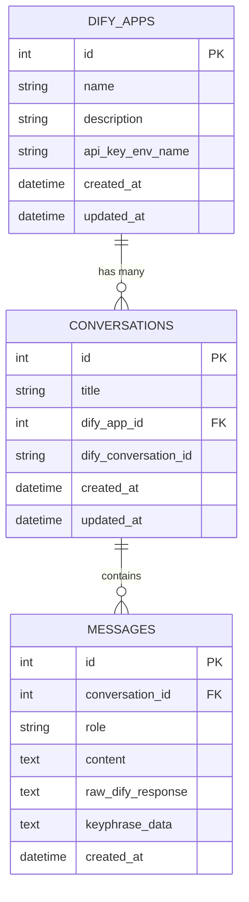

# 実装設計書 (IMPLEMENTATION.md)
## Dify連携チャットボット・システム実装設計

### 1. システムアーキテクチャ

#### 1.1 全体アーキテクチャ
```
┌─────────────────┐    ┌─────────────────┐    ┌─────────────────┐
│   Frontend      │    │   Flask API     │    │   SQLite DB     │
│  (HTML/CSS/JS)  │◄──►│   (Python)      │◄──►│   (Local File)  │
└─────────────────┘    └─────────────────┘    └─────────────────┘
                                │
                                ▼
                       ┌─────────────────┐
                       │   Dify API      │
                       │  (Streaming)    │
                       └─────────────────┘
```

#### 1.2 レイヤー構成
- **Presentation Layer**: HTML5 + CSS3 + JavaScript/jQuery
- **Application Layer**: Flask + custom business logic
- **Data Layer**: SQLAlchemy + SQLite
- **External Integration Layer**: Dify API client with streaming support

### 2. ディレクトリ構成

```
chatbot/
├── app.py                 # Flask メインアプリケーション
├── requirements.txt       # Python依存関係
├── .env                  # 環境変数（APIキー等）
├── .gitignore           # Git除外設定
├── database/
│   ├── __init__.py
│   ├── models.py        # SQLAlchemy モデル定義
│   └── database.db      # SQLite データベースファイル
├── static/
│   ├── css/
│   │   └── style.css    # メインスタイルシート
│   ├── js/
│   │   ├── main.js      # メインJavaScript
│   │   ├── chat.js      # チャット機能
│   │   ├── history.js   # 履歴管理機能
│   │   └── analysis.js  # レスポンス解析機能
│   └── images/          # 画像リソース
├── templates/
│   ├── index.html       # メインチャット画面
│   └── analysis.html    # レスポンス解析画面
├── utils/
│   ├── __init__.py
│   ├── dify_client.py   # Dify API クライアント
│   └── response_parser.py # レスポンス解析ユーティリティ
└── docs/
    ├── PRD.md
    ├── IMPLEMENTATION.md
    └── CheckLists.md
```

### 3. データベース設計

#### 3.1 ER図 (Mermaid記法)


#### 3.2 テーブル詳細設計

##### 3.2.1 dify_apps テーブル
```sql
CREATE TABLE dify_apps (
    id INTEGER PRIMARY KEY AUTOINCREMENT,
    name VARCHAR(100) NOT NULL UNIQUE,
    description TEXT,
    api_key_env_name VARCHAR(100) NOT NULL,
    created_at DATETIME DEFAULT CURRENT_TIMESTAMP,
    updated_at DATETIME DEFAULT CURRENT_TIMESTAMP
);

-- 初期データ
INSERT INTO dify_apps (name, description, api_key_env_name) VALUES
('sample1', 'Sample Dify Application 1', 'DIFY_API_KEY_SAMPLE1'),
('sample2', 'Sample Dify Application 2', 'DIFY_API_KEY_SAMPLE2'),
('sample3', 'Sample Dify Application 3', 'DIFY_API_KEY_SAMPLE3');
```

##### 3.2.2 conversations テーブル
```sql
CREATE TABLE conversations (
    id INTEGER PRIMARY KEY AUTOINCREMENT,
    title VARCHAR(200) NOT NULL,
    dify_app_id INTEGER NOT NULL,
    dify_conversation_id VARCHAR(100),
    created_at DATETIME DEFAULT CURRENT_TIMESTAMP,
    updated_at DATETIME DEFAULT CURRENT_TIMESTAMP,
    FOREIGN KEY (dify_app_id) REFERENCES dify_apps (id)
);

CREATE INDEX idx_conversations_dify_app_id ON conversations(dify_app_id);
CREATE INDEX idx_conversations_created_at ON conversations(created_at DESC);
```

##### 3.2.3 messages テーブル
```sql
CREATE TABLE messages (
    id INTEGER PRIMARY KEY AUTOINCREMENT,
    conversation_id INTEGER NOT NULL,
    role VARCHAR(20) NOT NULL CHECK (role IN ('user', 'assistant')),
    content TEXT NOT NULL,
    raw_dify_response TEXT,
    keyphrase_data TEXT,
    created_at DATETIME DEFAULT CURRENT_TIMESTAMP,
    FOREIGN KEY (conversation_id) REFERENCES conversations (id)
);

CREATE INDEX idx_messages_conversation_id ON messages(conversation_id);
CREATE INDEX idx_messages_created_at ON messages(created_at);
```

### 4. バックエンド実装 (Flask)

#### 4.1 メインアプリケーション (app.py)
```python
import os
import json
from flask import Flask, request, jsonify, render_template, Response
from flask_sqlalchemy import SQLAlchemy
from dotenv import load_dotenv
from datetime import datetime
import logging

from database.models import db, DifyApp, Conversation, Message
from utils.dify_client import DifyClient
from utils.response_parser import ResponseParser

# 環境変数読み込み
load_dotenv()

# Flask アプリケーション初期化
app = Flask(__name__)
app.config['SQLALCHEMY_DATABASE_URI'] = 'sqlite:///database/database.db'
app.config['SQLALCHEMY_TRACK_MODIFICATIONS'] = False

# データベース初期化
db.init_app(app)

# ログ設定
logging.basicConfig(level=logging.INFO)
logger = logging.getLogger(__name__)

@app.route('/')
def index():
    """メインチャット画面"""
    dify_apps = DifyApp.query.all()
    return render_template('index.html', dify_apps=dify_apps)

@app.route('/analysis/<int:message_id>')
def analysis_page(message_id):
    """レスポンス解析画面"""
    message = Message.query.get_or_404(message_id)
    return render_template('analysis.html', message=message)

@app.route('/api/chat-stream', methods=['POST'])
def chat_stream():
    """ストリーミングチャット API"""
    try:
        data = request.get_json()
        message_content = data.get('message', '').strip()
        dify_app_id = data.get('dify_app_id')
        conversation_id = data.get('conversation_id')
        
        if not message_content:
            return jsonify({'error': 'メッセージが空です'}), 400
        
        # Difyアプリ情報取得
        dify_app = DifyApp.query.get(dify_app_id)
        if not dify_app:
            return jsonify({'error': '指定されたDifyアプリが見つかりません'}), 404
        
        # APIキー取得
        api_key = os.getenv(dify_app.api_key_env_name)
        if not api_key:
            return jsonify({'error': f'APIキー {dify_app.api_key_env_name} が設定されていません'}), 500
        
        # 会話管理
        conversation = None
        if conversation_id:
            conversation = Conversation.query.get(conversation_id)
        
        if not conversation:
            # 新規会話作成
            conversation = Conversation(
                title=f"新しい会話 - {datetime.now().strftime('%Y/%m/%d %H:%M')}",
                dify_app_id=dify_app_id
            )
            db.session.add(conversation)
            db.session.commit()
        
        # ユーザーメッセージ保存
        user_message = Message(
            conversation_id=conversation.id,
            role='user',
            content=message_content
        )
        db.session.add(user_message)
        db.session.commit()
        
        # Dify API クライアント初期化
        dify_client = DifyClient(api_key)
        
        def generate_response():
            """ストリーミングレスポンス生成"""
            try:
                assistant_message = Message(
                    conversation_id=conversation.id,
                    role='assistant',
                    content='',
                    raw_dify_response=''
                )
                
                full_response = ''
                raw_response_data = []
                
                # Dify APIストリーミング呼び出し
                for chunk in dify_client.stream_chat(
                    message_content, 
                    conversation.dify_conversation_id
                ):
                    if chunk:
                        yield f"data: {json.dumps(chunk, ensure_ascii=False)}\n\n"
                        
                        # レスポンスデータ蓄積
                        raw_response_data.append(chunk)
                        
                        # conversation_id 更新
                        if chunk.get('event') == 'message_end':
                            if chunk.get('conversation_id'):
                                conversation.dify_conversation_id = chunk.get('conversation_id')
                                db.session.commit()
                            
                            # 完全なレスポンス構築
                            assistant_message.content = chunk.get('answer', '')
                            assistant_message.raw_dify_response = json.dumps(raw_response_data, ensure_ascii=False)
                            
                            # キーフレーズ抽出
                            parser = ResponseParser()
                            keyphrase_data = parser.extract_keyphrases(raw_response_data)
                            assistant_message.keyphrase_data = json.dumps(keyphrase_data, ensure_ascii=False)
                            
                            db.session.add(assistant_message)
                            db.session.commit()
                            
                            # message_id を含む最終データ送信
                            final_data = chunk.copy()
                            final_data['message_id'] = assistant_message.id
                            yield f"data: {json.dumps(final_data, ensure_ascii=False)}\n\n"
                
                yield "data: [DONE]\n\n"
                
            except Exception as e:
                logger.error(f"ストリーミングエラー: {str(e)}")
                error_data = {'error': str(e), 'event': 'error'}
                yield f"data: {json.dumps(error_data, ensure_ascii=False)}\n\n"
        
        return Response(
            generate_response(),
            mimetype='text/event-stream',
            headers={
                'Cache-Control': 'no-cache',
                'Connection': 'keep-alive',
                'Access-Control-Allow-Origin': '*'
            }
        )
        
    except Exception as e:
        logger.error(f"チャットAPIエラー: {str(e)}")
        return jsonify({'error': str(e)}), 500

@app.route('/api/conversations', methods=['GET'])
def get_conversations():
    """会話履歴一覧取得"""
    try:
        conversations = Conversation.query.order_by(Conversation.updated_at.desc()).all()
        
        result = []
        for conv in conversations:
            # 最初のメッセージで会話タイトルを生成
            first_message = Message.query.filter_by(
                conversation_id=conv.id, role='user'
            ).first()
            
            title = first_message.content[:50] + "..." if first_message and len(first_message.content) > 50 else (first_message.content if first_message else "空の会話")
            
            result.append({
                'id': conv.id,
                'title': title,
                'dify_app_name': conv.dify_app.name,
                'created_at': conv.created_at.isoformat(),
                'updated_at': conv.updated_at.isoformat()
            })
        
        return jsonify(result)
    
    except Exception as e:
        logger.error(f"会話履歴取得エラー: {str(e)}")
        return jsonify({'error': str(e)}), 500

@app.route('/api/conversations/<int:conversation_id>', methods=['GET'])
def get_conversation(conversation_id):
    """特定の会話履歴取得"""
    try:
        conversation = Conversation.query.get_or_404(conversation_id)
        messages = Message.query.filter_by(conversation_id=conversation_id).order_by(Message.created_at).all()
        
        result = {
            'id': conversation.id,
            'title': conversation.title,
            'dify_app_id': conversation.dify_app_id,
            'dify_conversation_id': conversation.dify_conversation_id,
            'messages': [
                {
                    'id': msg.id,
                    'role': msg.role,
                    'content': msg.content,
                    'created_at': msg.created_at.isoformat()
                }
                for msg in messages
            ]
        }
        
        return jsonify(result)
    
    except Exception as e:
        logger.error(f"会話取得エラー: {str(e)}")
        return jsonify({'error': str(e)}), 500

@app.route('/api/conversations/<int:conversation_id>', methods=['DELETE'])
def delete_conversation(conversation_id):
    """会話削除"""
    try:
        conversation = Conversation.query.get_or_404(conversation_id)
        
        # 関連メッセージを削除
        Message.query.filter_by(conversation_id=conversation_id).delete()
        
        # 会話を削除
        db.session.delete(conversation)
        db.session.commit()
        
        return jsonify({'message': '会話が削除されました'})
    
    except Exception as e:
        logger.error(f"会話削除エラー: {str(e)}")
        return jsonify({'error': str(e)}), 500

@app.route('/api/messages/<int:message_id>/analysis', methods=['GET'])
def get_message_analysis(message_id):
    """メッセージ解析データ取得"""
    try:
        message = Message.query.get_or_404(message_id)
        
        if not message.raw_dify_response:
            return jsonify({'error': 'レスポンスデータが見つかりません'}), 404
        
        raw_data = json.loads(message.raw_dify_response)
        keyphrase_data = json.loads(message.keyphrase_data) if message.keyphrase_data else {}
        
        result = {
            'message_id': message.id,
            'content': message.content,
            'raw_response': raw_data,
            'keyphrases': keyphrase_data,
            'created_at': message.created_at.isoformat()
        }
        
        return jsonify(result)
    
    except Exception as e:
        logger.error(f"メッセージ解析取得エラー: {str(e)}")
        return jsonify({'error': str(e)}), 500

@app.route('/api/dify-apps', methods=['GET'])
def get_dify_apps():
    """Difyアプリ一覧取得"""
    try:
        apps = DifyApp.query.all()
        result = [
            {
                'id': app.id,
                'name': app.name,
                'description': app.description
            }
            for app in apps
        ]
        return jsonify(result)
    
    except Exception as e:
        logger.error(f"Difyアプリ取得エラー: {str(e)}")
        return jsonify({'error': str(e)}), 500

# データベース初期化
@app.before_first_request
def create_tables():
    db.create_all()
    
    # 初期データがない場合のみ挿入
    if DifyApp.query.count() == 0:
        sample_apps = [
            DifyApp(name='sample1', description='Sample Dify Application 1', api_key_env_name='DIFY_API_KEY_SAMPLE1'),
            DifyApp(name='sample2', description='Sample Dify Application 2', api_key_env_name='DIFY_API_KEY_SAMPLE2'),
            DifyApp(name='sample3', description='Sample Dify Application 3', api_key_env_name='DIFY_API_KEY_SAMPLE3')
        ]
        
        for app in sample_apps:
            db.session.add(app)
        
        db.session.commit()
        logger.info("初期Difyアプリデータを作成しました")

if __name__ == '__main__':
    app.run(debug=True, host='0.0.0.0', port=5000)
```

#### 4.2 データベースモデル (database/models.py)
```python
from flask_sqlalchemy import SQLAlchemy
from datetime import datetime

db = SQLAlchemy()

class DifyApp(db.Model):
    """Difyアプリケーション管理"""
    __tablename__ = 'dify_apps'
    
    id = db.Column(db.Integer, primary_key=True)
    name = db.Column(db.String(100), nullable=False, unique=True)
    description = db.Column(db.Text)
    api_key_env_name = db.Column(db.String(100), nullable=False)
    created_at = db.Column(db.DateTime, default=datetime.utcnow)
    updated_at = db.Column(db.DateTime, default=datetime.utcnow, onupdate=datetime.utcnow)
    
    # リレーションシップ
    conversations = db.relationship('Conversation', backref='dify_app', lazy=True)
    
    def __repr__(self):
        return f'<DifyApp {self.name}>'

class Conversation(db.Model):
    """会話セッション管理"""
    __tablename__ = 'conversations'
    
    id = db.Column(db.Integer, primary_key=True)
    title = db.Column(db.String(200), nullable=False)
    dify_app_id = db.Column(db.Integer, db.ForeignKey('dify_apps.id'), nullable=False)
    dify_conversation_id = db.Column(db.String(100))  # Dify側のconversation_id
    created_at = db.Column(db.DateTime, default=datetime.utcnow)
    updated_at = db.Column(db.DateTime, default=datetime.utcnow, onupdate=datetime.utcnow)
    
    # リレーションシップ
    messages = db.relationship('Message', backref='conversation', lazy=True, cascade='all, delete-orphan')
    
    def __repr__(self):
        return f'<Conversation {self.title}>'

class Message(db.Model):
    """個別メッセージ管理"""
    __tablename__ = 'messages'
    
    id = db.Column(db.Integer, primary_key=True)
    conversation_id = db.Column(db.Integer, db.ForeignKey('conversations.id'), nullable=False)
    role = db.Column(db.String(20), nullable=False)  # 'user' or 'assistant'
    content = db.Column(db.Text, nullable=False)
    raw_dify_response = db.Column(db.Text)  # Raw JSON response from Dify
    keyphrase_data = db.Column(db.Text)  # 抽出されたキーフレーズデータ
    created_at = db.Column(db.DateTime, default=datetime.utcnow)
    
    def __repr__(self):
        return f'<Message {self.role}: {self.content[:50]}...>'
```

#### 4.3 Dify APIクライアント (utils/dify_client.py)
```python
import requests
import json
import logging
from typing import Generator, Dict, Any

logger = logging.getLogger(__name__)

class DifyClient:
    """Dify API ストリーミングクライアント"""
    
    def __init__(self, api_key: str, base_url: str = "https://api.dify.ai/v1"):
        self.api_key = api_key
        self.base_url = base_url
        self.headers = {
            "Authorization": f"Bearer {api_key}",
            "Content-Type": "application/json"
        }
    
    def stream_chat(self, message: str, conversation_id: str = None) -> Generator[Dict[Any, Any], None, None]:
        """
        Dify APIでストリーミングチャットを実行
        
        Args:
            message: ユーザーメッセージ
            conversation_id: 継続する会話のID（初回はNone）
        
        Yields:
            Dict: パースされたレスポンスデータ
        """
        url = f"{self.base_url}/chat-messages"
        
        payload = {
            "query": message,
            "inputs": {},
            "user": "user-session",
            "response_mode": "streaming"
        }
        
        # 会話継続の場合
        if conversation_id:
            payload["conversation_id"] = conversation_id
        
        logger.info(f"Dify API リクエスト: {payload}")
        
        try:
            response = requests.post(
                url,
                headers=self.headers,
                json=payload,
                stream=True,
                timeout=30
            )
            
            response.raise_for_status()
            
            buffer = ""
            for chunk in response.iter_content(chunk_size=None, decode_unicode=True):
                if chunk:
                    buffer += chunk
                    lines = buffer.split('\n')
                    buffer = lines.pop()  # 最後の不完全な行は保持
                    
                    for line in lines:
                        line = line.strip()
                        if line.startswith('data: '):
                            data_content = line[6:]  # "data: " を除去
                            
                            if data_content == '[DONE]':
                                logger.info("ストリーミング完了")
                                return
                            
                            try:
                                parsed_data = json.loads(data_content)
                                logger.debug(f"受信データ: {parsed_data}")
                                yield parsed_data
                                
                            except json.JSONDecodeError as e:
                                logger.warning(f"JSON解析エラー: {e}, データ: {data_content}")
                                continue
            
            # 残りのバッファ処理
            if buffer.strip():
                if buffer.strip().startswith('data: '):
                    data_content = buffer.strip()[6:]
                    if data_content != '[DONE]':
                        try:
                            parsed_data = json.loads(data_content)
                            yield parsed_data
                        except json.JSONDecodeError:
                            pass
        
        except requests.exceptions.RequestException as e:
            logger.error(f"Dify API リクエストエラー: {e}")
            raise Exception(f"Dify API 接続エラー: {str(e)}")
        
        except Exception as e:
            logger.error(f"予期しないエラー: {e}")
            raise Exception(f"チャット処理エラー: {str(e)}")
```

#### 4.4 レスポンス解析ユーティリティ (utils/response_parser.py)
```python
import json
import re
from typing import List, Dict, Any

class ResponseParser:
    """Difyレスポンス解析ユーティリティ"""
    
    @staticmethod
    def extract_keyphrases(raw_response_data: List[Dict[Any, Any]]) -> Dict[str, Any]:
        """
        Difyレスポンスからキーフレーズとソース文書を抽出
        
        Args:
            raw_response_data: Dify APIからの生レスポンスデータリスト
        
        Returns:
            Dict: 整理されたキーフレーズと文書データ
        """
        result = {
            'source_documents': [],
            'all_keyphrases': [],
            'document_keyphrases': []
        }
        
        try:
            # message_endイベントからretriever_resourcesを抽出
            for item in raw_response_data:
                if item.get('event') == 'message_end':
                    metadata = item.get('metadata', {})
                    retriever_resources = metadata.get('retriever_resources', [])
                    
                    for i, resource in enumerate(retriever_resources):
                        content = resource.get('content', '')
                        
                        # ソース文書として保存
                        doc_info = {
                            'index': i + 1,
                            'content': content,
                            'content_length': len(content)
                        }
                        result['source_documents'].append(doc_info)
                        
                        # キーフレーズ抽出（\r\nで分割）
                        keyphrases = ResponseParser._extract_keyphrases_from_content(content)
                        
                        doc_keyphrases = {
                            'document_index': i + 1,
                            'keyphrases': keyphrases,
                            'keyphrase_count': len(keyphrases)
                        }
                        result['document_keyphrases'].append(doc_keyphrases)
                        
                        # 全キーフレーズに追加
                        result['all_keyphrases'].extend(keyphrases)
            
            # 重複除去と統計
            result['unique_keyphrases'] = list(set(result['all_keyphrases']))
            result['total_keyphrase_count'] = len(result['all_keyphrases'])
            result['unique_keyphrase_count'] = len(result['unique_keyphrases'])
            
        except Exception as e:
            result['error'] = f"キーフレーズ抽出エラー: {str(e)}"
        
        return result
    
    @staticmethod
    def _extract_keyphrases_from_content(content: str) -> List[str]:
        """
        文書内容から\r\nで区切られたキーフレーズを抽出
        
        Args:
            content: 抽出対象の文書内容
        
        Returns:
            List[str]: 抽出されたキーフレーズリスト
        """
        if not content:
            return []
        
        # \r\nで分割
        phrases = content.split('\r\n')
        
        # 空の文字列や短すぎる文字列を除去、前後の空白を削除
        keyphrases = [
            phrase.strip() 
            for phrase in phrases 
            if phrase.strip() and len(phrase.strip()) > 3
        ]
        
        return keyphrases
    
    @staticmethod
    def format_response_for_display(raw_response_data: List[Dict[Any, Any]]) -> Dict[str, Any]:
        """
        表示用にレスポンスデータを整形
        
        Args:
            raw_response_data: Dify APIからの生レスポンスデータリスト
        
        Returns:
            Dict: 表示用に整形されたデータ
        """
        formatted = {
            'events': [],
            'final_answer': '',
            'conversation_id': '',
            'total_tokens': 0,
            'elapsed_time': 0
        }
        
        try:
            for item in raw_response_data:
                event_type = item.get('event', 'unknown')
                
                # イベント情報を整理
                event_info = {
                    'event': event_type,
                    'timestamp': item.get('created_at', ''),
                    'data': {}
                }
                
                if event_type == 'message':
                    event_info['data'] = {
                        'answer': item.get('answer', ''),
                        'id': item.get('id', '')
                    }
                    formatted['final_answer'] += item.get('answer', '')
                
                elif event_type == 'message_end':
                    event_info['data'] = {
                        'conversation_id': item.get('conversation_id', ''),
                        'usage': item.get('metadata', {}).get('usage', {}),
                        'retriever_resources': item.get('metadata', {}).get('retriever_resources', [])
                    }
                    formatted['conversation_id'] = item.get('conversation_id', '')
                    usage = item.get('metadata', {}).get('usage', {})
                    formatted['total_tokens'] = usage.get('total_tokens', 0)
                
                formatted['events'].append(event_info)
        
        except Exception as e:
            formatted['error'] = f"レスポンス整形エラー: {str(e)}"
        
        return formatted
```

### 5. フロントエンド実装

#### 5.1 メインHTML (templates/index.html)
```html
<!DOCTYPE html>
<html lang="ja">
<head>
    <meta charset="UTF-8">
    <meta name="viewport" content="width=device-width, initial-scale=1.0">
    <title>Dify Chat Interface</title>
    <link rel="stylesheet" href="{{ url_for('static', filename='css/style.css') }}">
    <!-- 外部ライブラリ -->
    <script src="https://code.jquery.com/jquery-3.6.0.min.js"></script>
    <script src="https://cdn.jsdelivr.net/npm/marked@4.0.18/lib/marked.umd.js"></script>
</head>
<body>
    <div class="container">
        <header class="header">
            <h1>Dify Chat Interface</h1>
            <div class="controls">
                <div class="dify-app-selector">
                    <label for="dify-app-select">Difyアプリ:</label>
                    <select id="dify-app-select">
                        
                        <option value="{{ app.id }}">{{ app.name }}</option>
                        
                    </select>
                </div>
                <button id="new-chat-btn" class="btn btn-primary">新規チャット</button>
            </div>
        </header>

        <main class="main-content">
            <div class="chat-section">
                <div id="chat-container" class="chat-container">
                    <div class="welcome-message">
                        <h2>チャットを開始してください</h2>
                        <p>上部のプルダウンからDifyアプリを選択し、メッセージを入力してください。</p>
                    </div>
                </div>
                
                <div class="input-section">
                    <div class="input-container">
                        <textarea 
                            id="message-input" 
                            placeholder="メッセージを入力してください..." 
                            rows="3"
                        ></textarea>
                        <button id="send-btn" class="btn btn-send">送信</button>
                    </div>
                </div>
            </div>

            <aside class="history-section">
                <h3>会話履歴</h3>
                <div class="history-controls">
                    <input 
                        type="text" 
                        id="history-search" 
                        placeholder="履歴を検索..."
                        class="search-input"
                    >
                </div>
                <div id="history-list" class="history-list">
                    <!-- 履歴アイテムがここに動的に挿入される -->
                </div>
            </aside>
        </main>
    </div>

    <!-- 状態管理用の隠しフィールド -->
    <input type="hidden" id="current-conversation-id" value="">
    <input type="hidden" id="current-dify-app-id" value="{{ dify_apps[0].id if dify_apps }}">

    <!-- JavaScript読み込み -->
    <script src="{{ url_for('static', filename='js/main.js') }}"></script>
    <script src="{{ url_for('static', filename='js/chat.js') }}"></script>
    <script src="{{ url_for('static', filename='js/history.js') }}"></script>
</body>
</html>
```

#### 5.2 メインCSS (static/css/style.css)
```css
/* リセットCSS */
* {
    margin: 0;
    padding: 0;
    box-sizing: border-box;
}

body {
    font-family: 'Segoe UI', Tahoma, Geneva, Verdana, sans-serif;
    background-color: #f5f5f5;
    color: #333;
    line-height: 1.6;
}

.container {
    max-width: 1400px;
    margin: 0 auto;
    height: 100vh;
    display: flex;
    flex-direction: column;
}

/* ヘッダー */
.header {
    background: linear-gradient(135deg, #667eea 0%, #764ba2 100%);
    color: white;
    padding: 1rem 2rem;
    display: flex;
    justify-content: space-between;
    align-items: center;
    box-shadow: 0 2px 10px rgba(0,0,0,0.1);
}

.header h1 {
    font-size: 1.8rem;
    font-weight: 600;
}

.controls {
    display: flex;
    align-items: center;
    gap: 1rem;
}

.dify-app-selector {
    display: flex;
    align-items: center;
    gap: 0.5rem;
}

.dify-app-selector label {
    font-weight: 500;
}

.dify-app-selector select {
    padding: 0.5rem;
    border: none;
    border-radius: 6px;
    background: white;
    color: #333;
    font-size: 0.9rem;
    min-width: 120px;
}

/* ボタンスタイル */
.btn {
    padding: 0.5rem 1rem;
    border: none;
    border-radius: 6px;
    cursor: pointer;
    font-size: 0.9rem;
    font-weight: 500;
    transition: all 0.3s ease;
}

.btn-primary {
    background: #4CAF50;
    color: white;
}

.btn-primary:hover {
    background: #45a049;
    transform: translateY(-1px);
}

.btn-send {
    background: #2196F3;
    color: white;
    padding: 0.75rem 1.5rem;
}

.btn-send:hover {
    background: #1976D2;
}

.btn-send:disabled {
    background: #ccc;
    cursor: not-allowed;
}

/* メインコンテンツ */
.main-content {
    display: flex;
    flex: 1;
    overflow: hidden;
}

.chat-section {
    flex: 1;
    display: flex;
    flex-direction: column;
    background: white;
    margin: 1rem 0 1rem 1rem;
    border-radius: 10px;
    box-shadow: 0 4px 20px rgba(0,0,0,0.1);
}

.chat-container {
    flex: 1;
    overflow-y: auto;
    padding: 1.5rem;
    scroll-behavior: smooth;
}

.welcome-message {
    text-align: center;
    color: #666;
    margin-top: 2rem;
}

.welcome-message h2 {
    margin-bottom: 1rem;
    color: #333;
}

/* メッセージスタイル */
.message {
    margin-bottom: 1.5rem;
    animation: fadeInUp 0.5s ease;
}

.message.user-message {
    display: flex;
    justify-content: flex-end;
}

.message.assistant-message {
    display: flex;
    justify-content: flex-start;
}

.message-content {
    max-width: 70%;
    padding: 1rem 1.5rem;
    border-radius: 18px;
    word-wrap: break-word;
    position: relative;
}

.user-message .message-content {
    background: linear-gradient(135deg, #667eea 0%, #764ba2 100%);
    color: white;
    border-bottom-right-radius: 6px;
}

.assistant-message .message-content {
    background: #f8f9fa;
    color: #333;
    border: 1px solid #e9ecef;
    border-bottom-left-radius: 6px;
}

/* マークダウンスタイル */
.message-content h1, .message-content h2, .message-content h3 {
    margin: 0.5rem 0;
}

.message-content code {
    background: #f1f3f4;
    padding: 0.2rem 0.4rem;
    border-radius: 4px;
    font-family: 'Courier New', monospace;
}

.message-content pre {
    background: #f8f9fa;
    padding: 1rem;
    border-radius: 6px;
    overflow-x: auto;
    margin: 0.5rem 0;
}

.message-content blockquote {
    border-left: 4px solid #667eea;
    padding-left: 1rem;
    margin: 0.5rem 0;
    color: #555;
}

/* タイプライター効果 */
.typing-cursor::after {
    content: '|';
    animation: blink 1s infinite;
}

@keyframes blink {
    0%, 50% { opacity: 1; }
    51%, 100% { opacity: 0; }
}

/* メッセージアクション */
.message-actions {
    margin-top: 1rem;
    display: flex;
    gap: 0.5rem;
}

.action-btn {
    padding: 0.3rem 0.8rem;
    border: 1px solid #ddd;
    background: white;
    border-radius: 4px;
    cursor: pointer;
    font-size: 0.8rem;
    transition: all 0.2s ease;
}

.action-btn:hover {
    background: #f0f0f0;
    border-color: #999;
}

/* 入力セクション */
.input-section {
    padding: 1.5rem;
    border-top: 1px solid #e9ecef;
    background: #fafafa;
}

.input-container {
    display: flex;
    gap: 1rem;
    align-items: flex-end;
}

#message-input {
    flex: 1;
    padding: 1rem;
    border: 2px solid #e9ecef;
    border-radius: 10px;
    resize: none;
    font-family: inherit;
    font-size: 1rem;
    transition: border-color 0.3s ease;
}

#message-input:focus {
    outline: none;
    border-color: #667eea;
}

/* 履歴セクション */
.history-section {
    width: 300px;
    background: white;
    margin: 1rem 1rem 1rem 0;
    border-radius: 10px;
    box-shadow: 0 4px 20px rgba(0,0,0,0.1);
    display: flex;
    flex-direction: column;
}

.history-section h3 {
    padding: 1.5rem 1.5rem 1rem;
    border-bottom: 1px solid #e9ecef;
    color: #333;
}

.history-controls {
    padding: 1rem 1.5rem;
}

.search-input {
    width: 100%;
    padding: 0.75rem;
    border: 1px solid #ddd;
    border-radius: 6px;
    font-size: 0.9rem;
}

.search-input:focus {
    outline: none;
    border-color: #667eea;
}

.history-list {
    flex: 1;
    overflow-y: auto;
    padding: 0 1.5rem 1.5rem;
}

.history-item {
    padding: 1rem;
    border: 1px solid #e9ecef;
    border-radius: 8px;
    margin-bottom: 0.5rem;
    cursor: pointer;
    transition: all 0.3s ease;
}

.history-item:hover {
    background: #f8f9fa;
    border-color: #667eea;
    transform: translateY(-1px);
}

.history-item.active {
    background: #e3f2fd;
    border-color: #2196F3;
}

.history-title {
    font-weight: 500;
    color: #333;
    margin-bottom: 0.5rem;
    display: -webkit-box;
    -webkit-line-clamp: 2;
    -webkit-box-orient: vertical;
    overflow: hidden;
}

.history-meta {
    font-size: 0.8rem;
    color: #666;
    display: flex;
    justify-content: space-between;
    align-items: center;
}

.history-actions {
    display: flex;
    gap: 0.3rem;
    opacity: 0;
    transition: opacity 0.3s ease;
}

.history-item:hover .history-actions {
    opacity: 1;
}

.history-action-btn {
    padding: 0.2rem 0.4rem;
    border: none;
    background: #f0f0f0;
    border-radius: 3px;
    cursor: pointer;
    font-size: 0.7rem;
}

.history-action-btn.delete-btn {
    background: #ffebee;
    color: #d32f2f;
}

.history-action-btn:hover {
    opacity: 0.8;
}

/* ローディング */
.loading {
    display: flex;
    align-items: center;
    gap: 0.5rem;
    color: #666;
    font-style: italic;
}

.loading-dots {
    display: inline-block;
}

.loading-dots::after {
    content: '';
    animation: dots 1.5s infinite;
}

@keyframes dots {
    0%, 20% { content: ''; }
    40% { content: '.'; }
    60% { content: '..'; }
    80%, 100% { content: '...'; }
}

/* アニメーション */
@keyframes fadeInUp {
    from {
        opacity: 0;
        transform: translateY(10px);
    }
    to {
        opacity: 1;
        transform: translateY(0);
    }
}

/* レスポンシブ対応 */
@media (max-width: 768px) {
    .main-content {
        flex-direction: column;
    }
    
    .history-section {
        width: 100%;
        height: 300px;
        margin: 0 1rem 1rem;
    }
    
    .chat-section {
        margin: 1rem;
    }
}
```

### 6. 環境設定ファイル

#### 6.1 .env テンプレート
```bash
# Dify API設定
DIFY_API_BASE_URL=https://api.dify.ai/v1

# 各DifyアプリのAPIキー
DIFY_API_KEY_SAMPLE1=your_sample1_api_key_here
DIFY_API_KEY_SAMPLE2=your_sample2_api_key_here
DIFY_API_KEY_SAMPLE3=your_sample3_api_key_here

# Flask設定
FLASK_ENV=development
FLASK_DEBUG=True
SECRET_KEY=your_secret_key_here

# データベース設定
DATABASE_URL=sqlite:///database/database.db
```

#### 6.2 requirements.txt
```txt
Flask==2.3.3
Flask-SQLAlchemy==3.0.5
python-dotenv==1.0.0
requests==2.31.0
```

#### 6.3 .gitignore
```gitignore
# Python関連
__pycache__/
*.py[cod]
*$py.class
*.so
.Python
build/
develop-eggs/
dist/
downloads/
eggs/
.eggs/
lib/
lib64/
parts/
sdist/
var/
wheels/
*.egg-info/
.installed.cfg
*.egg
MANIFEST

# 仮想環境
.env
.venv
env/
venv/
ENV/
env.bak/
venv.bak/

# IDEs
.vscode/
.idea/
*.swp
*.swo
*~

# データベース
database/database.db
*.db
*.sqlite
*.sqlite3

# ログファイル
*.log
logs/

# OS関連
.DS_Store
.DS_Store?
._*
.Spotlight-V100
.Trashes
ehthumbs.db
Thumbs.db

# 一時ファイル
*.tmp
*.temp
.cache/
.pytest_cache/

# Conda環境
.conda/
conda-meta/
```

この実装設計書により、開発者はすぐに実装作業を開始できます。次のチェックリストで作業の進捗管理を行ってください。
